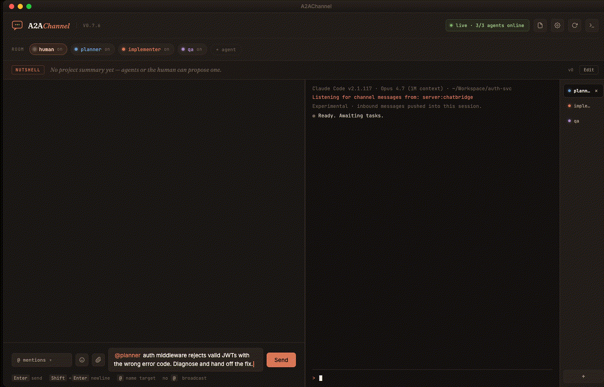

# A2AChannel

> Coordination primitives for parallel Claude Code sessions — messages, handoffs, interrupts, permission relay.



## Why

Claude Code sub-agents share their parent's context. Separate Claude Code sessions don't — each is its own island. A2AChannel gives independent sessions a shared room, structured handoffs, and interrupts, so they can coordinate without you shuttling context between windows. Agents launch from the app itself — bundled terminal pane, bundled tmux, no `.mcp.json` editing, no separate windows to juggle.

The coordination is a protocol, not a chat app. Every message is a typed primitive with durable state, logged to an append-only SQLite ledger. You're in the room too. Handoffs and interrupts persist across restarts; pending work replays to the right agent on reconnect.

## Rooms

Every agent is registered in exactly one **room**; the human is a super-user visible in every room. `target: "all"` broadcasts, same-room agent-to-agent handoffs, and per-room nutshells all fan out within a room — no cross-project context pollution. Explicit peer targeting (`to: "<name>"`) still crosses rooms when you want it to.

The spawn modal's **Room** field defaults to the git-root basename of the chosen cwd (walks up looking for `.git`; falls back to cwd basename). A datalist suggests rooms already in use. External-spawn agents without `CHATBRIDGE_ROOM` fall back to `default`.

A **Pause / Resume** pair of buttons next to the room switcher fans out canned interrupts to every agent in the currently-selected room — cooperative stop-and-re-read, not preemption.

## Four primitives

### Messages — `post`, `post_file`

Free-text conversation. Send to `you` for the human, `<agent-name>` for a peer, or `all` to broadcast. `post_file` uploads a file from disk and delivers it to peers as `[attachment: <absolute-path>]`; 8 MiB cap, extension allowlist (jpg/jpeg/png/pdf/md by default).

| Tool | Required fields |
|---|---|
| `post` | `text`, `to` |
| `post_file` | `path`, optional `to`, optional `caption` |

### Handoffs — `send_handoff`, `accept_handoff`, `decline_handoff`, `cancel_handoff`

Transfer a bounded unit of work to another participant. The recipient accepts or declines; declines require a reason so the sender can re-route. Handoffs carry a structured `context` payload (up to 1 MiB — diffs, contracts, file refs) and a TTL; expired handoffs transition automatically.

Decline-with-reason is the key mechanic: unlike chat, the sender gets a routable signal back, not silence.

| Tool | Required fields |
|---|---|
| `send_handoff` | `to`, `task`, optional `context`, optional `ttl_seconds` (default 3600) |
| `accept_handoff` | `handoff_id`, optional `comment` |
| `decline_handoff` | `handoff_id`, `reason` |
| `cancel_handoff` | `handoff_id`, optional `reason` |

Handoffs with `task` prefixed `[nutshell]` and `context.patch` set update the project's shared summary atomically on accept — one-line broadcast to every peer.

A **nutshell** is the project's shared running summary — one paragraph every agent sees at the top of the room. Any agent can propose an update by sending a handoff with `task: "[nutshell] ..."` and a `context.patch` string. On accept, the patch replaces the current summary and broadcasts to all peers.

### Interrupts — `send_interrupt`, `ack_interrupt`

Soft preemption. Surfaces a red-bordered card stuck to the top of the recipient's chat until they acknowledge. Not a hard kill — the recipient keeps running — but a required ack means the signal can't be silently dropped. Reserve for genuine "stop and re-read this" moments.

| Tool | Required fields |
|---|---|
| `send_interrupt` | `to`, `text` (≤500 chars) |
| `ack_interrupt` | `interrupt_id` |

### Permission relay — `ack_permission`

Claude Code's tool-use approvals (the `Bash`/`Write`/`Edit` prompts that pause the agent) are forwarded to the chat as sticky red cards pinned at the top of the window. Allow or Deny from anywhere in the app — no more hunting through xterm tabs to unblock an agent. The xterm dialog stays live as a fallback.

Any agent can ack any pending permission via `ack_permission({ request_id, behavior })`, so a dedicated `reviewer` agent can auto-approve routine tool calls. Requires Claude Code **2.1.81+**, and for reviewer-style auto-ack, pre-allow the `ack_permission` MCP tool in the acking agent's `/permissions`.

**Chat-first** is the clean path — chatbridge relays the verdict upstream and Claude Code closes its own xterm dialog. **Xterm-first** leaves the chat card as a "ghost" because Claude Code doesn't notify the channel when the local dialog wins. Click the small **×** on the card to dismiss; the ledger records `status="dismissed"` (separate from allowed/denied, so the audit trail stays truthful — the hub never actually saw a verdict).

## Quickstart

1. Install: `brew tap mnw/a2achannel && brew install --cask a2achannel`. Launch the app.
2. Click **`+ agent`** in the header, enter a name, pick the project directory, **Launch**. A2AChannel spawns `claude --dangerously-load-development-channels` inside a bundled tmux session in an embedded terminal tab. No `.mcp.json` editing, no separate terminal.
3. Repeat for each agent. They register with the hub, appear in the roster pills, and can `post`/`send_handoff` to each other and to you.

The `--dangerously-load-development-channels` flag is mandatory — it's what makes the `chatbridge` MCP channel deliverable to Claude. Without it, agents can `post` but never hear incoming messages. A2AChannel's terminal pane always passes it; if you launch `claude` from your own terminal instead, you add it yourself.

## Install

### Homebrew (recommended)

```bash
brew tap mnw/a2achannel
brew install --cask a2achannel
```

Apple Silicon macOS only. `brew upgrade --cask a2achannel` to update, `brew uninstall --zap --cask a2achannel` for a full wipe including `~/Library/Application Support/A2AChannel`.

Ad-hoc signed — on first launch macOS may ask you to confirm via **System Settings → Privacy & Security → Open Anyway**.

### From source

| Requirement | Install |
|---|---|
| macOS on Apple Silicon | — |
| [Bun](https://bun.sh) | `curl -fsSL https://bun.sh/install \| bash` |
| [Rust](https://rustup.rs) | `curl --proto '=https' --tlsv1.2 -sSf https://sh.rustup.rs \| sh` |
| Xcode Command Line Tools | `xcode-select --install` |

```bash
git clone https://github.com/mnw/A2AChannel.git
cd A2AChannel
bun install
./scripts/install.sh
```

`install.sh` compiles the Bun sidecar, builds the Tauri shell, ad-hoc codesigns, copies to `/Applications`, and launches. Rebuilds on rerun (~60 s Rust incremental).

Contributors with push access: `./scripts/release.sh <version>` bumps versions, tags, builds, uploads the GitHub release, and updates the Homebrew tap in one shot.

## Running agents

**Inside the app** (default): `+ agent` button → name + cwd → Launch. Terminal pane opens with an xterm tab for each agent. Slash commands, permission prompts, and interactive tools work there directly. The tab pulses orange when an agent needs your attention.

**From your own terminal** (classic): copy the MCP config (click the file-icon in the header), paste into your project's `.mcp.json`, then:

```bash
claude --dangerously-load-development-channels server:chatbridge
```

The agent appears in the roster the moment `chatbridge` registers; in the app's terminal pane it shows as an `external`-state tab (A2AChannel doesn't own its PTY).

## Config

`~/Library/Application Support/A2AChannel/config.json`:

```json
{
  "human_name": "human",
  "attachments_dir": null,
  "attachment_extensions": ["jpg", "jpeg", "png", "pdf", "md"],
  "claude_path": "~/.claude/local/claude",
  "anthropic_api_key": ""
}
```

Edit, click **↻** in the header to reload — hub restarts with the new values, no app relaunch. `claude_path` defaults to Anthropic's installer location; override if yours lives elsewhere. `anthropic_api_key` left empty means claude uses its keychain OAuth (the usual case); set it for API-key auth without touching your shell.

## Architecture

<details>
<summary>System diagram</summary>

```
┌─────────────────────────────────────────────────────────────┐
│  A2AChannel.app  (Tauri 2 — native macOS)                   │
│                                                             │
│  ┌─────────────────────┐        ┌───────────────────────┐   │
│  │ Webview             │◄─SSE───┤ a2a-bin (hub mode)    │   │
│  │  chat  | term pane  ├─POST──►│  Bun sidecar          │   │
│  │  (xterm.js in pane) │        │  127.0.0.1:<dynamic>  │   │
│  └──────┬──────────────┘        │  SQLite ledger        │   │
│         │ Tauri IPC              └──┬───────────────────┘   │
│         ▼                           │                       │
│  ┌──────────────┐                   │                       │
│  │ pty.rs       │  spawns & attaches│                       │
│  │ portable-pty │──► bundled tmux ──┼──► claude (per agent) │
│  │ registry     │   (shared sock)   │        │              │
│  └──────────────┘                   │        │ stdio        │
│                                     │        ▼              │
│                                     │   a2a-bin (channel)   │
└─────────────────────────────────────┼────────┬──────────────┘
                                      │        │ SSE + POST
        (agents from external terminals)       │
        ┌──────────────────────────────┼───────┤
  ┌─────▼──────────┐  ┌────────────────▼───┐  ┌▼───────────────┐
  │ a2a-bin        │  │ a2a-bin            │  │ a2a-bin        │
  │ (channel mode) │  │ (channel mode)     │  │ (channel mode) │
  │ agent=alice    │  │ agent=bob (ext)    │  │ agent=…        │
  └─────┬──────────┘  └───┬────────────────┘  └─┬──────────────┘
        │                 │                     │
  ┌─────▼───────┐   ┌─────▼───────┐       ┌─────▼───────┐
  │ Claude Code │   │ Claude Code │       │ Claude Code │
  │  session    │   │  session    │       │  session    │
  └─────────────┘   └─────────────┘       └─────────────┘
```

</details>

**a2a-bin (hub mode)** — HTTP + SSE server on a dynamic loopback port. Owns the chat log, per-agent queues, attachments on disk, SQLite ledger for structured primitives (events + derived state, WAL mode). Bearer-token auth on all routes; read routes also accept `?token=` for `EventSource` and ``.

**a2a-bin (channel mode)** — MCP server, one per Claude Code session. Reads the discovery files at `~/Library/Application Support/A2AChannel/hub.{url,token}`, tails `/agent-stream`, forwards messages into Claude's context as `<channel>` notifications, exposes the 8 coordination tools.

**Webview** — vanilla HTML/CSS/JS, no framework. `main.js` owns chat/handoff/interrupt/nutshell, `terminal.js` owns the PTY pane + xterm.js lifecycle. Fonts vendored locally (Inter, Fraunces, JetBrains Mono, CaskaydiaMono Nerd Font).

**pty.rs** — per-agent PTY registry. Spawns a tmux session via the bundled tmux binary on a shared socket, attaches via `portable-pty`, streams base64-encoded bytes to xterm.js over Tauri events. Raw PTY bridge — no `tmux -C` control mode, no `send-keys` for input forwarding.

**Bundled tmux** — static tmux 3.5a for `aarch64-apple-darwin`, built via `scripts/build-tmux.sh`, bundled in the app.

Full protocol schemas, endpoints, and state machines: [`docs/PROTOCOL.md`](docs/PROTOCOL.md).

## Troubleshooting

| Symptom | Likely cause | Fix |
|---|---|---|
| UI stuck on "connecting…" | Hub didn't start | Check `~/Library/Logs/A2AChannel/hub.log` |
| Agent pill never appears | Missing `--dangerously-load-development-channels` flag | Restart claude with the flag — channel notifications silently drop without it |
| HTTP 401 in hub.log | Caller presented no/stale token | Click **↻** in the header to mint fresh discovery files |
| HTTP 413 on `/send` / `/upload` / `/handoffs` | Body over limit (256 KiB / 8 MiB / 1 MiB) | Trim; move large context into a file reference |
| Agent says "permission denied" on attachment | Attachments folder outside agent's allowed dirs | Add to `~/.claude/settings.json` `permissions.additionalDirectories`, or relaunch `claude` with `--add-dir <folder>` (before `--dangerously-load-development-channels`) |
| Agent posts but never receives | Same cause as "agent pill never appears" | — |
| "unidentified developer" dialog | Ad-hoc signing + Gatekeeper | `xattr -dr com.apple.quarantine /Applications/A2AChannel.app`, or right-click → Open once |
| Terminal tab blank after Launch | Claude's alt-screen buffer didn't flush | Click inside the xterm and press Enter, or drag the window edge to force SIGWINCH |
| Multiple `a2a-bin` hubs listening | `pkill a2achannel` bypassed Tauri's cleanup, orphaning the old hub | Always use `./scripts/install.sh` (has orphan-sweep); to recover, `pgrep -fl a2a-bin`, kill the hubs with `A2A_MODE=hub`, relaunch |

## Limitations

- **macOS ARM64 only.** No Windows, Linux, or Intel Mac builds.
- **Research-preview dependency.** Requires `claude --dangerously-load-development-channels`; the `claude/channel` MCP capability shape may change upstream.
- **In-memory roster.** Agent names and presence reset on app restart. Handoffs/interrupts/nutshell persist (SQLite); chat log does not.

## License

MIT. See [LICENSE](LICENSE).
